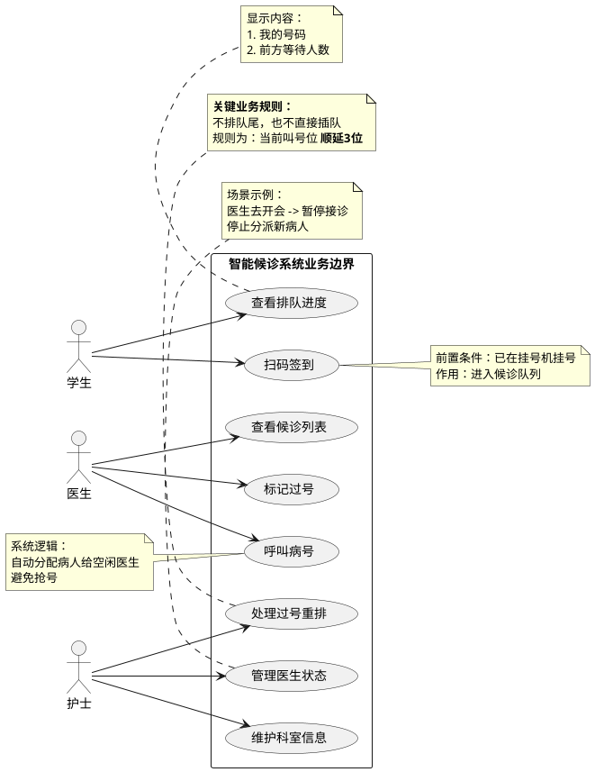

我是业务分析师。基于您提供的《校医院智能候诊系统需求调研》访谈录音，我完成了业务提取与建模工作。

以下是详细的业务模型分析成果，包含参与者定义、业务术语表、详细用例清单以及 PlantUML 用例图。

### 1. 参与者识别 (Actors)

| 参与者 | 说明 |
| :--- | :--- |
| **学生** (Student) | 前来就诊的患者。主要通过手机进行签到和查看进度。 |
| **医生** (Doctor) | 坐诊医师。主要负责呼叫病人和维持就诊秩序（如过号处理）。 |
| **护士** (Nurse) | 分诊台管理人员。负责处理异常情况（如过号重排）及基础信息维护。 |

---

### 2. 业务术语表 (Business Glossary)

| 术语 (Term) | 描述 (Description) | 同义词/备注 |
| :--- | :--- | :--- |
| **扫码签到** | 学生到达科室门口后，扫描二维码以证明“人已到场”并触发进入排队队列的动作。 | 报到、入队 |
| **候诊队列** | 已经完成挂号且完成了“扫码签到”的学生排队列表。 | 排队列表 |
| **呼叫病号** | 医生触发系统通知下一位候诊学生进入诊室，通常联动大屏语音和手机推送。 | 叫号 |
| **过号** | 医生呼叫后学生未到场，医生将其标记为错过当前就诊机会的状态。 | 跳过 |
| **过号重排** | 护士对“过号”的学生进行重新排队操作。**业务规则：当前叫号位顺延 3 位**。 | 激活、复诊重排 |
| **医生状态** | 标识医生当前是否可接诊（如：正常接诊、暂停接诊/开会）。 | - |

---

### 3. 业务用例清单 (Business Use Case List)

在绘制图表之前，我们将识别出的业务功能点整理为详细清单，确保覆盖了访谈中的所有核心需求。

| ID | 用例名称 | 参与者 | 简要描述 |
| :--- | :--- | :--- | :--- |
| **BUC01** | **扫码签到** | 学生 | 扫描科室门口二维码，触发入队逻辑。系统需验证挂号信息。 |
| **BUC02** | **查看排队进度** | 学生 | 在手机上查看当前排队号码、前方等待人数及当前呼叫号码。 |
| **BUC03** | **查看候诊列表** | 医生 | 在诊室电脑查看当前分配给自己或科室的待诊学生列表。 |
| **BUC04** | **呼叫病号** | 医生 | 点击“叫号”按钮，触发大屏语音和手机通知。含自动分配逻辑。 |
| **BUC05** | **标记过号** | 医生 | 多次呼叫无果后，将当前就诊号标记为“过号”，系统自动呼叫下一位。 |
| **BUC06** | **处理过号重排** | 护士 | 针对过号回来的学生，将其插入当前队列（规则：当前号+3）。 |
| **BUC07** | **管理医生状态** | 护士 | 修改医生的接诊状态（如将“坐诊”改为“暂停”），控制是否分派新病人。 |
| **BUC08** | **维护科室信息** | 护士 | 修改科室的基础信息（如将“内科”改为“发热门诊”）。 |

---

### 4. 业务用例图 (PlantUML)

该用例图详细展示了各角色与功能的交互，并**使用注释（Note）标记了访谈中提到的关键业务规则**（如过号顺延3位、自动分配等），以体现建模的细致度。

