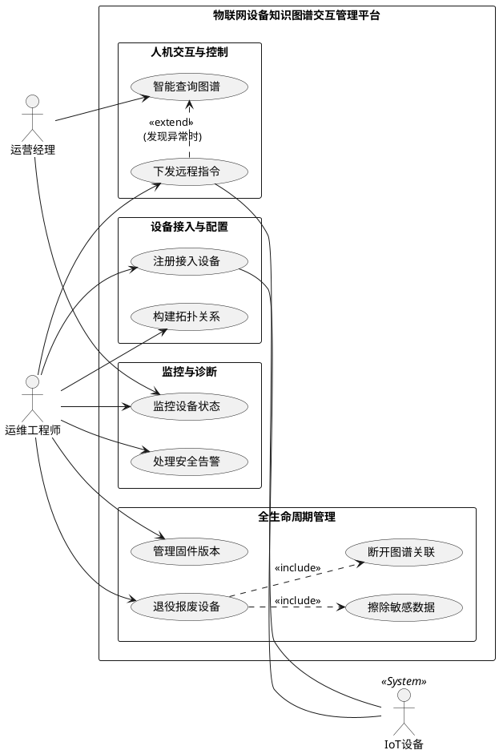

基于之前的访谈录音，作为业务分析师，我为您整理了以下的参与者列表、用例表、PlantUML用例图代码以及关键业务术语表。

### 1. 参与者表 (Actor List)

| 参与者 (Actor) | 描述 |
| :--- | :--- |
| **运营经理** | 关注宏观业务指标、设备整体运行状况及空间分析的角色。主要通过自然语言交互进行决策支持。 |
| **运维工程师** | 负责设备全生命周期管理的角色，包括配置、维护、控制、升级及报废处理，确保系统稳定运行。 |
| **IoT设备** | (系统外部实体) 指代实际接入平台的物理硬件（如传感器、网关），它们主动发起连接并上报数据，是用例的次要参与者。 |

---

### 2. 业务用例表 (Use Case List)

| 用例编号 | 用例名 (Verb + Noun) | 用例概述 (Goal) | 主参与者 |
| :--- | :--- | :--- | :--- |
| **UC-01** | **注册接入设备** | 完成新设备的身份认证（双向证书），并在平台建立基础档案。 | 运维工程师 |
| **UC-02** | **构建拓扑关系** | 在知识图谱中定义设备与空间（楼宇/房间）及网络设备（网关）之间的关联关系。 | 运维工程师 |
| **UC-03** | **监控设备状态** | 查看设备在线/离线状态，并在拓扑图上定位受故障影响的关联节点。 | 运营经理、运维工程师 |
| **UC-04** | **智能查询图谱** | 通过自然语言（大模型助手）查询设备分布、状态及异常原因，获取分析报告。 | 运营经理 |
| **UC-05** | **下发远程指令** | 通过自然语言或界面操作，对特定设备或设备组批量发送控制指令（如重启）。 | 运维工程师 |
| **UC-06** | **管理固件版本** | 执行固件的灰度测试及全量推送，并在图谱中追踪版本分布。 | 运维工程师 |
| **UC-07** | **退役报废设备** | 执行设备下线流程，包括擦除敏感数据、收回凭证及断开图谱关联。 | 运维工程师 |
| **UC-08** | **处理安全告警** | 接收并响应由异常流量或攻击行为（如DDoS）触发的安全警报。 | 运维工程师 |

---

### 3. PlantUML 用例图代码

您可以将以下代码复制到 PlantUML 编辑器中查看可视化效果。

---

### 4. 关键业务术语表 (Key Business Terms)

| 术语 (Term) | 描述 (Description) | 同义词/相关词 (Synonym) |
| :--- | :--- | :--- |
| **知识图谱 (Knowledge Graph)** | 用于存储设备、空间、规则及其相互关系的图结构数据库。不同于传统关系型数据库，它侧重于管理“节点”与“边”的连接。 | 图数据库、Neo4j |
| **拓扑关系 (Topology)** | 描述设备在物理空间（层级）或网络逻辑（连接）上的位置关系。例如：传感器属于房间，网关连接交换机。 | 关联关系、节点关系 |
| **MQTT** | 一种轻量级的消息传输协议，广泛用于IoT设备与云端的通信。 | 消息队列遥测传输 |
| **灰度测试 (Grey-scale Testing)** | 在全量发布固件前，先选取小部分设备（设备组）进行更新测试，以降低风险。 | 金丝雀发布、小范围测试 |
| **智能助手 (Agent)** | 基于大语言模型（LLM）构建的交互模块，能解析用户的自然语言指令并转化为SQL或图查询语句（Cypher）。 | 大模型助手、Copilot |
| **僵尸节点 (Zombie Node)** | 指物理设备已移除，但图谱中仍残留的孤立数据节点。需要在退役流程中清理。 | 孤立节点、无效数据 |
| **双向认证 (Mutual Auth)** | 客户端验证服务器，服务器也验证客户端证书的安全机制，防止非法设备接入。 | 双向SSL/TLS |

---

### 分析师备注（符合标准说明）：
1.  **参与者设定**：去除了“系统管理员”这一模糊角色，将安全审计功能归纳给了一线的“运维工程师”，因为录音中李工（工程师）表现出对安全告警的直接关注。同时将物理层面的“IoT设备”列为次要参与者，体现其与注册和控制用例的交互。
2.  **用例命名**：严格遵守了“动词+名词”结构（如“构建拓扑关系”而非“拓扑管理”），并确保每个用例都是一个完整的业务目标（如“退役报废设备”是一个完整流程，包含了擦除数据等步骤）。
3.  **粒度控制**：将“擦除敏感数据”设为“退役报废设备”的`<<include>>`子用例，因为录音中李工强调这是退役过程中不可或缺的一步，若不完成则退役不完整。