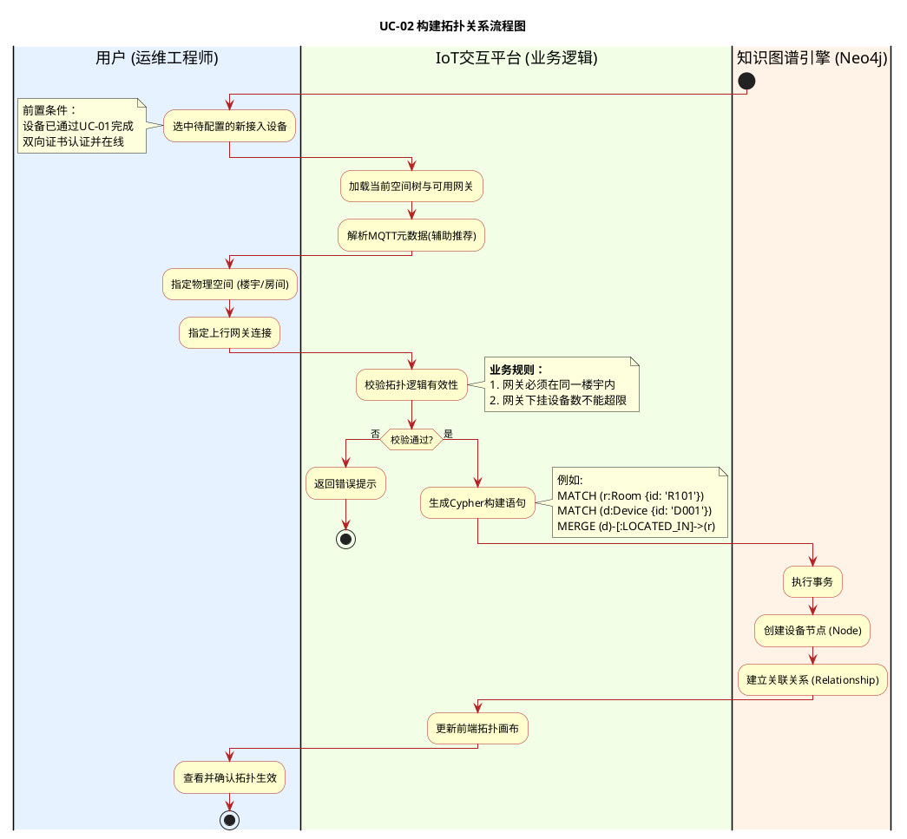
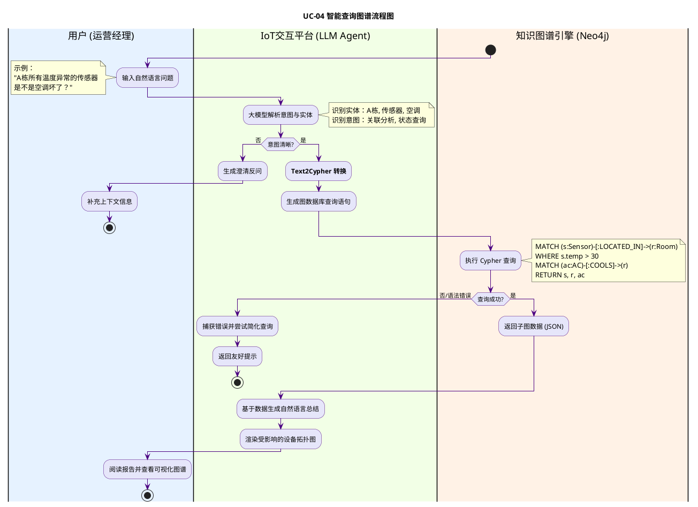
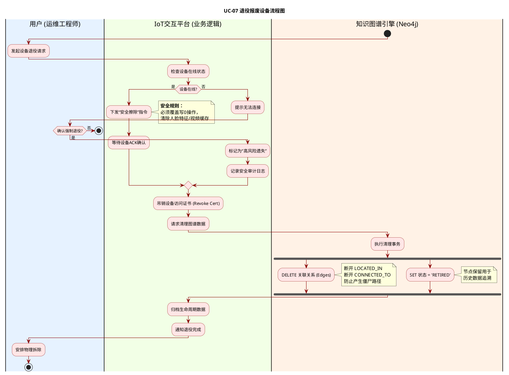

### 1. UC-02 构建拓扑关系 (Maintain Graph Topology)

此图展示了设备注册后，如何通过业务逻辑校验，最终在图数据库中通过 `MERGE` 语句建立节点与边的过程。

---

### 2. UC-04 智能查询图谱 (Intelligent QA Diagnosis)

此图重点体现了 **大模型（Agent）** 作为中间层，将非结构化的自然语言（NL）转化为结构化的图查询语言（Cypher），并处理查询结果的闭环。

---

### 3. UC-07 退役报废设备 (Decommission Device)

此图展示了严格的退役顺序：**先擦除物理数据，再清理逻辑关系**。这是物联网安全管理的关键路径。

### 绘图要点总结（Review）：

1.  **泳道划分**：三个用例均严格遵循了 `User` -> `Platform` -> `Graph Engine` 的分层架构。
2.  **UC-02 逻辑**：清晰展示了从用户输入参数到图数据库执行 `MERGE` 语句创建节点和关系的过程。
3.  **UC-04 逻辑**：体现了 AI Agent 的核心价值——将 NL（自然语言） 翻译为 Cypher，并将结构化结果翻译回 NL。
4.  **UC-07 逻辑**：使用了 `fork` 并行处理图谱清理操作，并使用了 `if/else` 处理在线/离线两种不同的擦除流程，体现了业务的严谨性。
5.  **业务备注**：所有关键步骤（如Cypher示例、安全规则）都通过 `note` 进行了标注。