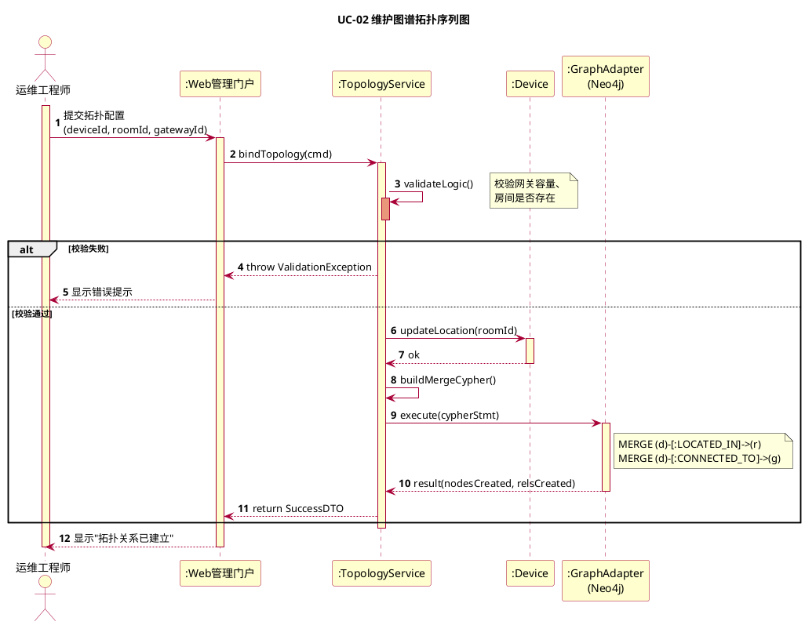
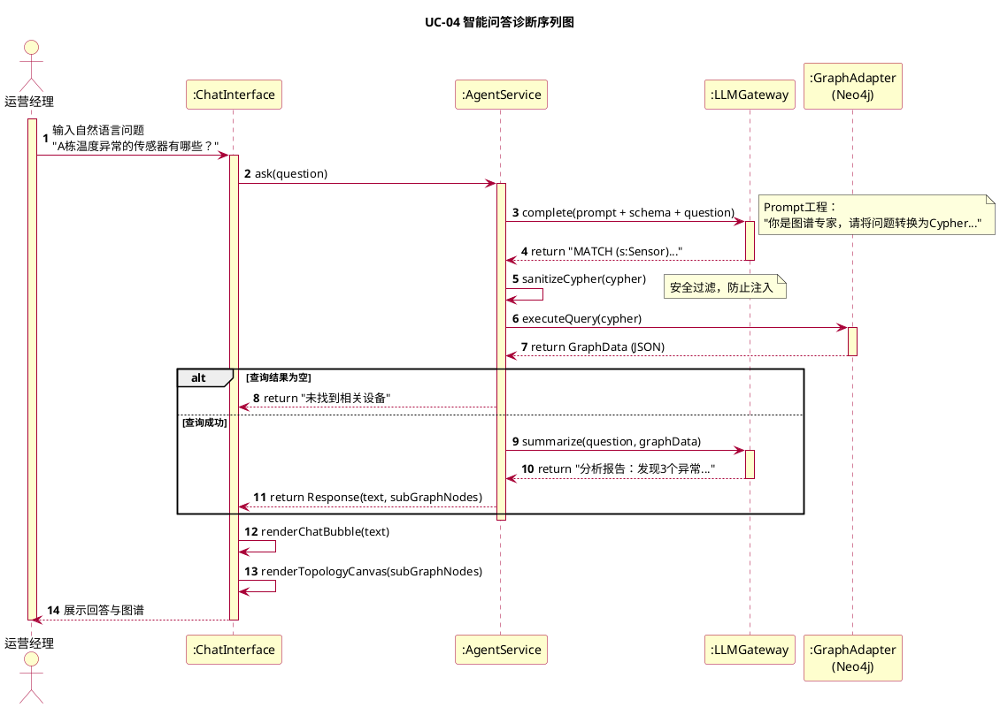
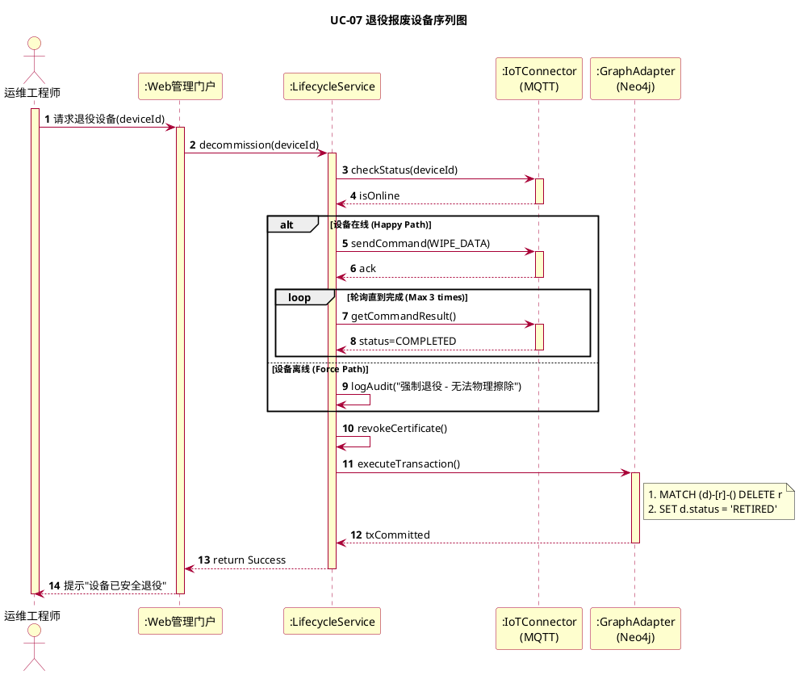

这是基于之前的架构设计（包图）和业务流程（活动图）绘制的 **PlantUML 序列图**。

这些图表严格遵循了以下原则：
1.  **分层调用原则**：Actor -> UI -> Application Service -> Infrastructure -> Domain/DB。
2.  **Rose 配色风格**：黄色对象、红色线条。
3.  **完整组件**：包含生命线、激活条（Activation Bar）、返回消息（Dashed Arrow）以及关键的组合片段（Alt/Loop）。

---

### 1. UC-02 维护图谱拓扑 (Maintain Graph Topology)

**核心逻辑**：
该序列图展示了典型的 **OLTP（联机事务处理）** 流程。重点在于 `TopologyService` 如何充当协调者，先校验业务规则（领域逻辑），再调用 `GraphAdapter` 执行具体的 Cypher 语句（基础设施逻辑）。

---

### 2. UC-04 智能问答诊断 (Intelligent QA Diagnosis)

**核心逻辑**：
这是一个典型的 **RAG (Retrieval-Augmented Generation)** 流程。
1.  **Text-to-Cypher**：先找 LLM 要查询语句。
2.  **Graph Query**：拿着语句去查图数据库。
3.  **Summarization**：把查到的数据扔回给 LLM 做总结。

---

### 3. UC-07 退役报废设备 (Decommission Device)

**核心逻辑**：
展示了复杂的业务协同。
1.  **远程控制**：通过 MQTT 清除物理数据。
2.  **数据一致性**：物理清除成功后，才能清理图谱关系。
3.  **异常处理**：使用 `alt` 片段处理“设备离线”的强制退役场景。

### 绘图细节说明（符合规范）：

1.  **对象命名规范**：
    *   UI层使用了 `WebPortal`, `ChatInterface`。
    *   服务层使用了 `Service` 结尾（如 `TopologyService`），对应包图中的 Application Layer。
    *   基础设施层使用了 `Adapter` 或 `Gateway` 结尾，体现了**依赖倒置**原则（应用层只依赖接口，不依赖具体实现）。

2.  **生命线与激活条**：
    *   每个对象（LifeLine）都有垂直虚线。
    *   每当收到消息（实线箭头）时，对应的生命线上会出现矩形条（激活条），表示该对象正在占用 CPU 处理任务。
    *   处理完毕返回时，使用虚线箭头（Reply Message），激活条结束。

3.  **组合片段 (Combined Fragments)**：
    *   **UC-02**: 使用 `alt` 处理校验失败的情况。
    *   **UC-04**: 使用 `alt` 处理查不到数据的情况。
    *   **UC-07**: 使用 `alt` 区分在线/离线流程，使用 `loop` 模拟等待设备响应的过程。

4.  **业务逻辑体现**：
    *   在序列图中不仅仅画了“存数据”，还画出了“生成Cypher”、“校验逻辑”、“Prompt工程”等具体动作，这正是我们在“阶段2”活动图里定义的内容。