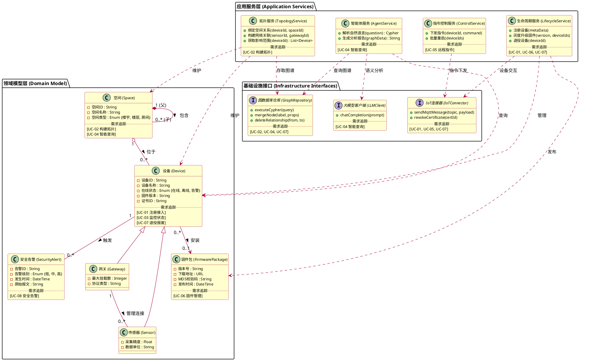

这是一个基于前几个阶段（用例、包图、序列图）分析得出的**系统级类图**。

### 设计说明：
1.  **架构分层**：为了清晰展示，我将类分为了 **Domain (领域实体层)**、**Application (应用服务层)** 和 **Infrastructure (基础设施接口层)**。这符合包图的架构。
2.  **符号规范**：
    *   **实心菱形 (组合)**：用于“空间”结构（楼宇包含房间，楼宇没了房间也没了）。
    *   **空心三角 (泛化)**：用于设备类型的继承（传感器、网关都属于设备）。
    *   **虚线箭头 (依赖)**：服务层依赖接口层，或服务层依赖实体层。
3.  **需求追踪**：每个类内部底部的区域标注了该类主要支撑的 `[UC编号]`，满足你的追踪要求。
4.  **候选实体**：只列出了核心属性，隐藏了 Getter/Setter 和非核心方法，保持图面整洁。

---

### PlantUML 类图代码

### 关键点解读

1.  **实体关系（Domain Layer）**：
    *   **Space (组合) Space**：体现了 `Space` 是一个树状结构（楼宇 -> 楼层 -> 房间）。用了实心菱形，因为如果“A栋”被删除了，里面的“301室”也就没有存在的意义了。
    *   **Gateway (关联) Sensor**：体现了物理连接拓扑。
    *   **Space (聚合) Device**：用了空心菱形。因为设备是可以移动的，如果把“301室”删了，里面的“传感器”并不会消失，只是变成了“未分配位置”的状态。

2.  **服务职责（Application Layer）**：
    *   **TopologyService**：专门干 UC-02（构建拓扑）的事，它需要同时操作 `Device` 和 `Space` 两个实体。
    *   **AgentService**：对应 UC-04，它是一个编排者，左手调 LLM 翻译意图，右手调 GraphRepo 查库。

3.  **依赖倒置（Infrastructure Layer）**：
    *   服务层只依赖 `Interface`（如 GraphRepository），而不依赖具体的 `Neo4jDriver` 类。这在类图中表现为服务层通过虚线依赖接口。

4.  **需求追踪**：
    *   我在每个类里加了分割线 `.. 需求追踪 ..`，清晰地列出了该类是为了实现哪个 UC 而存在的。例如 `Device` 类几乎参与了所有 UC，而 `Firmware` 类只服务于 UC-06。